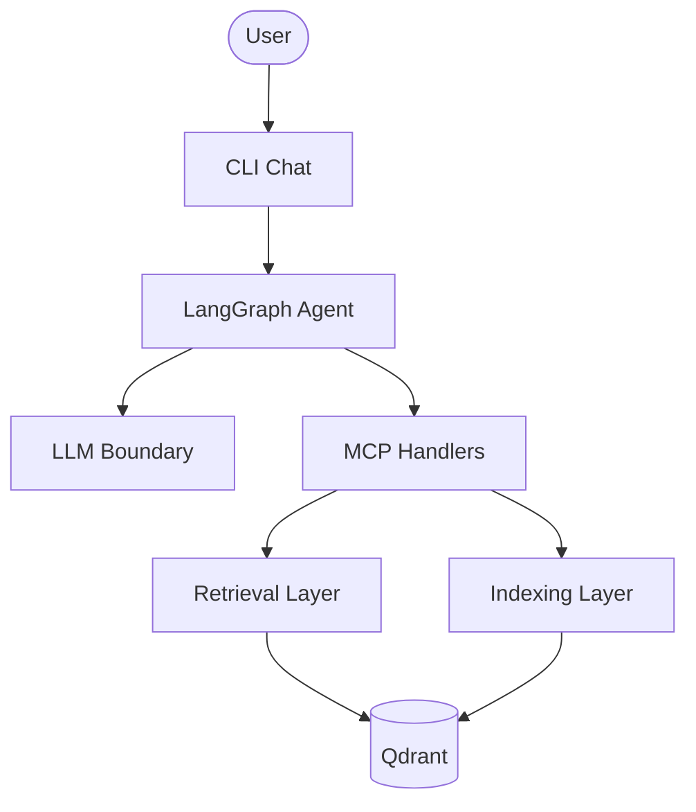

# Production RAG Knowledge Assistant

A **local educational demo** that demonstrates **production-style architecture patterns** for knowledge assistants: hybrid retrieval over Qdrant, an **MCP-style typed handler boundary** (in-process today; SDK transport deferred), LangGraph agent orchestration, and measurable retrieval evaluation.

The project accompanies a Production RAG lecture. It prioritizes architectural clarity and reproducible workflows over deployed enterprise operations.

### Why this repository is worth reading

- **Layered architecture** with explicit component boundaries — agent, MCP handlers, retrieval, indexing, storage, LLM — documented in ADRs and enforced in code.
- **Hybrid retrieval pipeline** — BGE-M3 dense + sparse → RRF fusion → cross-encoder rerank — with a 70-case evaluation benchmark comparing four strategies.
- **592 passing tests** (4 model-marker tests skipped by default) covering MCP contracts, retrieval composition, agent tool loops, and CLI workflows.
- **Honest scope** — deferred capabilities (MCP SDK transport, query rewriting, durable memory) and intentional non-goals are documented, not hidden.
- **Reproducible demo path** — synthetic corpus generator, bootstrap CLI (`rag demo`, `rag evaluate`, `rag chat`), and stub-first smoke workflow.
- **Source attribution** — every retrieval hit carries document title, path, section, and line range for inspectable answers.
- **Decision discipline** — 86 architectural decision records with an index in [docs/DECISIONS.md](docs/DECISIONS.md).

### Current implementation status

| Capability | Status | Notes |
| ---------- | ------ | ----- |
| LangGraph agent with tool loop | **Implemented** | Streaming chat via `rag chat` |
| MCP-style typed handler boundary | **Implemented** (in-process) | [ADR-034](docs/DECISIONS.md#adr-034-mcp-handler-layer-without-sdk-runtime) |
| MCP SDK stdio/network transport | **Deferred** | Proposed Plan 12c — see [docs/PROGRESS.md](docs/PROGRESS.md) |
| Hybrid retrieval + reranking | **Implemented** | Dense, sparse, fusion, rerank strategies |
| Retrieval evaluation benchmark | **Implemented** | 70 cases; document-level metrics only |
| Query rewriting / retrieval retry | **Deferred** | Proposed Plan 12b — see [docs/PROGRESS.md](docs/PROGRESS.md) |
| Tier 2 browse tools (`get_document`, `get_statistics`) | **Deferred** | Not in current MCP surface |
| Durable agent memory | **Deferred** (session-local today) | [ADR-045](docs/DECISIONS.md#adr-045-in-memory-conversation-state-only), [ADR-073](docs/DECISIONS.md#adr-073-session-persistence-policy) |
| Production deployment / auth / observability | **Out of scope** | [PROJECT.md](PROJECT.md#non-goals) |

> **Operational non-goals.** This repository intentionally omits authentication, deployment manifests, health-check endpoints, structured tracing, metrics dashboards, runbooks for production operations, and durable conversation persistence. These absences reflect [PROJECT.md](PROJECT.md#non-goals) scope — the goal is architectural demonstration, not a deployable service. Chat uses in-process session state only; nothing is written to disk between turns.

---

## Project Overview

### Business problem

Large language models cannot reliably answer questions about proprietary company documentation. A knowledge assistant must retrieve relevant internal documents first, then generate a grounded answer with inspectable sources.

Simple dense vector search alone is often insufficient. Production systems typically combine semantic search, lexical search, fusion, reranking, and explicit source attribution.

### What this project demonstrates

| Capability | Implementation |
| ---------- | -------------- |
| Conversational assistant | LangGraph agent with tool loop and streaming chat |
| Knowledge boundary | MCP-style typed handlers (`search_documents`, indexing tools; in-process) |
| Document indexing | LlamaIndex loading and chunking → Qdrant |
| Hybrid retrieval | BGE-M3 dense + sparse → RRF fusion → BGE reranker |
| Source attribution | Document title, path, section, line range on every hit |
| Retrieval evaluation | 70-case benchmark with Hit Rate@K, Recall@K, MRR |
| Demo workflow | Synthetic corpus generation, bootstrap CLI, interactive chat |

### Why hybrid RAG

Dense retrieval captures semantic similarity. Sparse (lexical) retrieval captures exact terminology, acronyms, and policy language. Reciprocal Rank Fusion (RRF) combines both rank lists without score calibration. A cross-encoder reranker reorders the fused candidate pool for final context selection.

The evaluation framework compares **dense**, **sparse**, **fusion**, and **rerank** strategies on the same benchmark so trade-offs are measurable, not anecdotal.

### Educational vs production-style design

- **Educational:** clear layer boundaries, stub providers for fast local runs, documented ADRs, local benchmark reproduction workflow.
- **Production-style patterns:** real BGE-M3 embeddings, real BGE reranker, human-in-the-loop index rebuild approval, structured citations, offline retrieval metrics.

This is **not** a deployed production service. Language throughout this README uses *production-style* to mean patterns commonly found in enterprise RAG systems, implemented here as a local demo.

### High-level architecture



> **MCP boundary today.** Knowledge tools (`search_documents`, indexing preview/apply) are implemented as **typed in-process handlers** matching the MCP tool contract. There is no runnable MCP SDK stdio or network server in this repository — SDK transport is deferred (proposed Plan 12c). See [ADR-034](docs/DECISIONS.md#adr-034-mcp-handler-layer-without-sdk-runtime).

The agent never talks to Qdrant directly. All knowledge access flows through MCP-style handlers.

---

## Architecture

### Request path (chat)

```text
User
  ↓
CLI Chat (`rag chat`)
  ↓
LangGraph Agent
  ↓
MCP client adapters (in-process)
  ↓
MCP-style knowledge handlers (typed tool contract)
  ↓
Retrieval Layer
  ↓
Qdrant
```

On corpus-related questions the agent calls `search_documents`, receives ranked chunks with citations, and generates a grounded answer. General-knowledge questions are answered directly without searching.

### Retrieval internals

Production chat and MCP search use the full stack:

```text
Dense Retrieval (BGE-M3)
      +
Sparse Retrieval (BGE-M3 lexical vectors)
      ↓
Fusion (Reciprocal Rank Fusion)
      ↓
Reranker (BGE cross-encoder or deterministic stub)
      ↓
Top context chunks with SourceReference metadata
```

### Component responsibilities

| Component | Owns | Must not own |
| --------- | ---- | ------------ |
| LangGraph Agent | Conversation, routing, tool selection, prompts | Retrieval implementation, Qdrant access |
| MCP Server | Knowledge tools (`search_documents`, indexing preview/apply) | Agent behavior, LLM calls |
| Retrieval Layer | Dense, sparse, fusion, reranking | LLM interaction |
| Indexing Layer | Loading, parsing, chunking, write-path embeddings | Retrieval decisions |
| Qdrant Storage | Vector storage and chunk payloads | Business logic |
| LLM Boundary | All model inference | Retrieval, indexing, storage |
| Evaluation Layer | Benchmark metrics and strategy comparison | Agent answers, MCP transport |

### Dependency flow

```text
agent → mcp_server → retrieval → storage
agent → llm
indexing → storage
```

Forbidden shortcuts include `mcp_server → llm`, `retrieval → llm`, and `agent → qdrant`.

Deeper reference: [docs/ARCHITECTURE.md](docs/ARCHITECTURE.md), [docs/DECISIONS.md](docs/DECISIONS.md), [PROJECT.md](PROJECT.md).

---

## Knowledge Base

### Synthetic corporate corpus

The demo knowledge base is a **synthetic internal documentation corpus** for **AcmeCloud Analytics**, a fictional cloud analytics company. Documents cover HR policies, engineering runbooks, security, finance, product, SRE, and platform architecture.

The corpus is designed as a **retrieval benchmark instrument**, not filler text. Content includes distinctive terminology, cross-links, and benchmark-aligned policy language so dense, sparse, fusion, and rerank strategies produce measurable differences.

### Corpus generation

| Property | Value |
| -------- | ----- |
| Company | AcmeCloud Analytics |
| Manifest | `tools/knowledge_generator/manifests/corpus.v1.yaml` |
| Document inventory | 96 documents |
| Generated output | `knowledge/` (gitignored; regenerate locally) |
| Files after generation | 97 (96 documents + `knowledge/README.md`) |
| Formats | `.md`, `.txt` |
| Internal systems | Atlas, Beacon, Mercury, Orion, Ledger, Gatehouse, Harbor |

Regenerate the corpus:

```bash
python3 tools/knowledge_generator/generator.py
```

The generator applies quality gates (duplicate detection, section diversity, filler-phrase checks) before writing files.

### Benchmark alignment

Retrieval evaluation uses `data/evaluation/retrieval_benchmark_v1.json`:

| Property | Value |
| -------- | ----- |
| Cases | 70 curated questions |
| Gold documents | 7 benchmark-canonical paths under `knowledge/policies/` and `knowledge/procedures/` |
| Labeling | `expected_document_key` → document registry → corpus path |
| Matching | Normalized `SearchResult.source.document_path` |

Benchmark-canonical paths include `policies/remote_work_policy.md`, `policies/security_policy.md`, and `procedures/incident_response.md`.

Short corpus excerpts for GitHub inspection (without running the generator): [docs/examples/](docs/examples/).

---

## Indexing Workflow

Indexing turns local files into dense and sparse vectors stored in Qdrant.

### Prerequisites

- Python 3.12+ and [uv](https://docs.astral.sh/uv/)
- Qdrant running locally

```bash
uv sync
docker compose up -d
cp .env.example .env   # optional; configure LLM for chat
```

### Step-by-step

**1. Generate the corpus**

```bash
python3 tools/knowledge_generator/generator.py
```

**2. Inspect environment (read-only)**

```bash
uv run rag demo info
```

Reports corpus presence, document count, collection status, chunk count, and the configured retrieval pipeline label.

**3. Index the corpus**

```bash
uv run rag demo load
```

**4. Confirm index readiness**

```bash
uv run rag demo info
```

**5. Reindex after embedding mode changes**

```bash
uv run rag demo load --rebuild --approve
```

Both `--rebuild` and `--approve` are required to replace an existing collection.

**6. Delete the demo collection (optional)**

```bash
uv run rag demo reset --approve
```

Override the corpus directory with `RAG_CORPUS_ROOT` (default: `knowledge/`).

### What happens during indexing

```text
local .md / .txt files
    ↓
LlamaIndex SimpleDirectoryReader (loading)
    ↓
LlamaIndex SentenceSplitter (chunking: 1024 chars, 128 overlap)
    ↓
core domain models + line-range attribution from raw source text
    ↓
DenseEmbeddingProvider + SparseEmbeddingProvider (stub or BGE-M3)
    ↓
VectorStore.upsert_chunks → Qdrant (named dense + sparse vectors)
```

- **Chunking:** `SentenceSplitter` with character tokenizer; default chunk size 1024, overlap 128.
- **Embeddings:** indexing owns write-path dense and sparse vectors; retrieval owns query-path embeddings.
- **Storage:** Qdrant collection `knowledge_chunks` (configurable) with named `dense` and `sparse` vectors plus nine-field chunk payloads.
- **Collection creation:** `demo load` creates the collection on first run; rebuild deletes and recreates it when approved.
- **Human approval:** destructive rebuild and reset operations require explicit `--approve` flags.

---

## Retrieval Pipeline

All retrieval is deterministic — no LLM calls inside the retrieval layer.

### Dense retrieval

- **Model:** `BAAI/bge-m3` (opt-in via `RAG_EMBEDDING_MODE=real`)
- **Path:** `SearchQuery` → `BgeM3QueryEmbeddingProvider.embed_query` → `VectorStore.search_dense`
- **Vectors:** 1024-dimensional L2-normalized dense embeddings
- **Default:** hash-based `StubQueryEmbeddingProvider` for CI and fast local runs

### Sparse retrieval

- **Model:** BGE-M3 lexical weights from the same shared runtime (Plan 20)
- **Path:** `SearchQuery` → `BgeM3SparseQueryEmbeddingProvider.embed_query` → lexical weight conversion → `VectorStore.search_sparse`
- **Vectors:** variable-length sparse vectors (sorted token indices + ReLU weights)
- **Status:** real sparse write and query paths are implemented. Collections indexed before real sparse integration stored placeholder sparse vectors and must be reindexed for meaningful sparse and fusion metrics.

### Fusion

- **Algorithm:** Reciprocal Rank Fusion (RRF)
- **Implementation:** `FusionRetriever` runs dense and sparse leaf retrievers with expanded `leaf_top_k`, merges rank lists, deduplicates by chunk ID, and truncates to `query.top_k`
- **Scores:** fused `SearchResult.score` values are ordinal RRF keys — not comparable to dense, sparse, or reranker scores

### Reranking

- **Model:** `BAAI/bge-reranker-v2-m3` (opt-in via `RAG_RERANKER_MODE=real`)
- **Implementation:** `RerankRetriever` expands the candidate pool, calls `Reranker.rerank`, preserves candidate count, sorts by relevance score
- **Default:** `StubReranker` (deterministic token overlap) for CI
- **Production wiring:** MCP `search_documents` and chat use `RerankRetriever(FusionRetriever(...), reranker)`

---

## Chat Demo

### Prerequisites

1. Qdrant running: `docker compose up -d`
2. Corpus generated and indexed: see [Indexing Workflow](#indexing-workflow)
3. LLM gateway configured in `.env` (`LLM_BASE_URL`, `LLM_API_KEY`, `LLM_MODEL`)

Load environment variables into your shell (the CLI does not read `.env` automatically):

```bash
set -a && source .env && set +a
```

For meaningful retrieval quality, enable real embeddings and reranker, then reindex before chatting.

### Start interactive chat

```bash
uv run rag chat
```

### Example interaction

The assistant searches the internal corpus for policy questions, answers from retrieved evidence, and prints structured sources after each turn.

```text
You: How many days per week can staff work from home?

Assistant:
Hybrid employees may work from home up to three days per week by default.
Teams may approve up to four days per week with director approval. Fully
remote employees work from an approved home office five days per week.

Sources:

[1] Remote and Hybrid Work Policy
    File: …/knowledge/policies/remote_work_policy.md
    Section: Requirements
    Lines: 52-74
```

Source paths reflect the indexed absolute filesystem path on your machine; evaluation normalizes them to `knowledge/…` for benchmark matching.

### Additional chat options

```bash
# Single turn (scripts / testing)
uv run rag chat --message "How many days per week can staff work from home?"

# Disable streaming
uv run rag chat --no-stream --message "Summarize the security policy"

# Omit the Sources block
uv run rag chat --no-sources
```

**Behavior notes:**

- Chat validates corpus and index preconditions at startup (exit `3` if missing).
- The startup banner shows the configured LLM model name only — not `LLM_BASE_URL` (endpoint URLs may contain internal hostnames or IPs).
- LLM connectivity is checked on the first message, not at startup.
- Off-topic questions (general knowledge, geography, trivia) are answered directly **without** `search_documents`.
- Corpus questions trigger hybrid retrieval and render the numbered Sources block unless `--no-sources` is set.

---

## Evaluation

The evaluation layer measures **retrieval quality only** — not LLM answer quality or agent behavior.

### Benchmark limitations

The benchmark is intentionally narrow for educational use:

- **Document-level relevance only** — one gold document per case; no chunk-level labels.
- **No negative or off-topic cases** — every question expects a corpus hit.
- **No answer faithfulness** — metrics do not evaluate generated LLM responses.
- **No latency or throughput testing** — correctness metrics only.
- **Corpus version not hash-verified** — reproducibility depends on regenerating the corpus locally from the committed manifest.
- **No automated CI benchmark gate** — validation runs stub providers; authoritative numbers require local real-model evaluation.

### Reproducing benchmark results

**Preconditions:**

1. Corpus generated: `python3 tools/knowledge_generator/generator.py`
2. Qdrant running: `docker compose up -d`
3. Corpus indexed (stub or real embeddings)
4. For authoritative model-quality numbers: `RAG_EMBEDDING_MODE=real`, optional `RAG_RERANKER_MODE=real`, then `rag demo load --rebuild --approve`

**Stub mode (wiring check):**

```bash
uv run rag demo load
uv run rag evaluate compare
```

**Real mode (authoritative Hit@K numbers):**

```bash
export RAG_EMBEDDING_MODE=real
export RAG_RERANKER_MODE=real
uv run rag demo load --rebuild --approve
uv run rag evaluate compare
```

The CLI prints a configuration banner before results. Stub mode includes an explicit non-authoritative notice. No benchmark snapshot artifacts are committed to the repository — reproduce locally using the commands above.

### Commands

```bash
# Prerequisites: corpus indexed (see Indexing Workflow)

uv run rag evaluate run --strategy dense
uv run rag evaluate run --strategy sparse
uv run rag evaluate run --strategy fusion
uv run rag evaluate run --strategy rerank

uv run rag evaluate compare
```

### Optional flags

| Flag | Default | Purpose |
| ---- | ------- | ------- |
| `--dataset PATH` | `data/evaluation/retrieval_benchmark_v1.json` | Benchmark JSON |
| `--eval-top-k INT` | `5` | Retrieval depth per case |
| `--metrics-k` | `1,3,5` | K cutoffs for Hit Rate@K and Recall@K |

### Metrics

| Metric | Meaning |
| ------ | ------- |
| **Hit Rate@K** | Fraction of cases where the expected document appears in the top K results |
| **Recall@K** | Same as Hit Rate@K for this benchmark (one relevant document per case) |
| **MRR** | Mean reciprocal rank of the first correct document |

Relevance is determined by matching normalized `SearchResult.source.document_path` against the benchmark document registry.

### Stub vs real model modes

Evaluate inherits `RAG_EMBEDDING_MODE` and `RAG_RERANKER_MODE` from bootstrap.

- **Stub mode:** runs successfully; useful for wiring checks and relative strategy behavior. Absolute numbers are **not** authoritative for model-quality claims.
- **Real mode:** requires `RAG_EMBEDDING_MODE=real`, optional `RAG_RERANKER_MODE=real`, and a corpus reindexed with those settings.

The CLI prints a configuration banner before results. Stub mode includes an explicit non-authoritative notice.

---

## Benchmark Results

Measured on `data/evaluation/retrieval_benchmark_v1.json` (70 cases, `eval_top_k=5`) with `RAG_EMBEDDING_MODE=real`, `RAG_RERANKER_MODE=real`, and a corpus reindexed after real sparse integration (`rag demo load --rebuild --approve`).

### Current results (Hit@1)

| Strategy | Hit@1 |
| -------- | ----- |
| dense | 0.743 |
| sparse | 0.671 |
| fusion | 0.729 |
| rerank | 0.714 |

### Comparison with Plan 20 baseline (placeholder sparse)

Before reindexing with real BGE-M3 sparse vectors, sparse retrieval contributed no lexical signal (identical placeholder vectors per chunk). After reindex:

| Strategy | Hit@1 (baseline) | Hit@1 (current) |
| -------- | ---------------- | --------------- |
| dense | 0.743 | 0.743 |
| sparse | 0.000 | 0.671 |
| fusion | ≈ dense | 0.729 |
| rerank | slight improvement over dense | 0.714 |

**Baseline source:** [docs/plans/completed/20-real-sparse-embeddings-integration.md](docs/plans/completed/20-real-sparse-embeddings-integration.md) (real dense + real reranker, placeholder sparse). Baseline also reported dense Hit@3 = 0.871 and Hit@5 = 0.914.

### Takeaways

- **Real sparse reindex** unlocks lexical retrieval: sparse rises from 0.000 to 0.671 Hit@1.
- **Fusion (0.729)** sits between dense and sparse — RRF combines both signals without matching dense alone on this benchmark.
- **Rerank (0.714)** is slightly below dense Hit@1 here; cross-encoder reordering does not always improve document-level Hit@1 on every query mix (rerank optimizes chunk-level relevance within the fused pool).

### Reproduce locally

```bash
export RAG_EMBEDDING_MODE=real
export RAG_RERANKER_MODE=real
uv run rag demo load --rebuild --approve
uv run rag evaluate compare
```

---

## Running With Real Models

Real model runtimes are opt-in. Stub providers remain the default for CI.

### Enable real embeddings (dense + sparse together)

```bash
export RAG_EMBEDDING_MODE=real
export RAG_EMBEDDING_DEVICE=cpu    # or cuda when GPU is available
export RAG_EMBEDDING_MODEL=BAAI/bge-m3
```

### Enable real reranker

```bash
export RAG_RERANKER_MODE=real
export RAG_RERANKER_MODEL=BAAI/bge-reranker-v2-m3
export RAG_RERANKER_DEVICE=cpu    # or auto, cuda
```

### Reindex (required)

```bash
uv run rag demo load --rebuild --approve
```

**Why reindex is required:** dense and sparse vectors from stub providers are incompatible with real BGE-M3 vectors. Switching `RAG_EMBEDDING_MODE` between `stub` and `real` always requires a full collection rebuild with explicit approval. The first real run may download model weights from Hugging Face.

Inspect configuration without loading models:

```bash
uv run rag demo info
```

Useful settings: see [.env.example](.env.example) for `RAG_EMBEDDING_*`, `RAG_RERANKER_*`, and optional real-model smoke test flags.

---

## Project Progress

Phases delivered to date (from [docs/PROGRESS.md](docs/PROGRESS.md)):

| Phase | Deliverable |
| ----- | ----------- |
| Governance & Python bootstrap | Documentation skeleton, `uv` project, quality toolchain |
| Domain models | Shared `core` types, `SourceReference`, validation |
| Qdrant storage | `VectorStore` protocol, dense + sparse named vectors |
| Indexing pipeline | LlamaIndex chunking, line attribution, embedding providers |
| Dense retrieval | `DenseRetriever`, query embedding boundary |
| Sparse retrieval | `SparseRetriever`, sparse search |
| Fusion | `FusionRetriever`, RRF |
| Reranking | `RerankRetriever`, stub reranker |
| MCP handler layer | `search_documents`, indexing preview/apply, citations |
| LLM boundary | OpenAI-compatible client, tool-call transport |
| LangGraph agent | Tool loop, RAG prompts, MCP adapters |
| Evaluation framework | 70-case benchmark, Hit Rate@K / Recall@K / MRR |
| Synthetic knowledge base | 96-document AcmeCloud corpus generator |
| Demo bootstrap | `rag demo info/load/reset`, composition root |
| Real dense embeddings | BGE-M3 dense runtime |
| Real reranker | BGE cross-encoder runtime |
| Strategy evaluation CLI | `rag evaluate run/compare` |
| Interactive chat | `rag chat` streaming REPL with source rendering |
| Real sparse embeddings | BGE-M3 lexical vectors on write and query paths |

---

## Fastest smoke demo (stub mode)

Recommended first run — no LLM gateway, no real model downloads. Stub embedding and reranker providers exercise the full pipeline.

```bash
# 1. Dependencies and Qdrant
uv sync
docker compose up -d

# 2. Generate corpus and index (stub providers are the default)
python3 tools/knowledge_generator/generator.py
uv run rag demo info
uv run rag demo load
uv run rag demo info

# 3. Compare retrieval strategies on the benchmark
uv run rag evaluate compare
```

The CLI does **not** auto-load `.env`. For chat or custom endpoints, load variables manually: `set -a && source .env && set +a` (see [.env.example](.env.example)).

### Expected output (abbreviated)

**`rag demo info`** (before indexing; count includes generated `knowledge/README.md`):

```text
Corpus exists: yes
Corpus document count: 97
Collection exists: no
Collection chunk count: 0
Retrieval pipeline: dense + sparse → fusion (RRF) → rerank (stub embeddings)
Qdrant URL: http://localhost:6333
Collection name: knowledge_chunks
Corpus path: …/knowledge
```

**`rag demo load`:**

```text
indexed demo corpus: documents=97, chunks=…, collection=knowledge_chunks
```

**`rag evaluate compare`** (stub mode — wiring check, not authoritative benchmarks):

```text
Evaluation configuration:
  Dataset: retrieval_benchmark_v1
  Cases: 70
  Eval top_k: 5
  Metrics k: 1,3,5
  Embedding mode: stub
  Reranker mode: stub
  Note: stub provider mode — results verify wiring and relative strategy behavior,
        not authoritative model-quality benchmarks.

Comparison Report: retrieval_benchmark_v1
Cases: 70
Eval top_k: 5

Metric        dense    sparse   fusion   rerank
Hit@1         …        …        …        …
...
MRR           …        …        …        …
```

Exact metric values depend on stub provider behavior and are not comparable to real-model results in [Benchmark Results](#benchmark-results).

---

## Full demo (real models + chat)

```bash
# 1. Dependencies and infrastructure
uv sync
docker compose up -d
cp .env.example .env   # configure LLM_* for chat

# 2. Corpus and index
python3 tools/knowledge_generator/generator.py
uv run rag demo load

# 3. Real models (then reindex)
export RAG_EMBEDDING_MODE=real
export RAG_RERANKER_MODE=real
uv run rag demo load --rebuild --approve

# 4. Evaluate retrieval
uv run rag evaluate compare

# 5. Chat (requires LLM gateway)
set -a && source .env && set +a
uv run rag chat
```

---

## Local Infrastructure (Qdrant)

```bash
docker compose up -d          # start (data persisted in Docker volume)
docker compose down           # stop, keep data
docker compose down -v        # stop and delete indexed data
```

Default endpoint: `http://localhost:6333` (`QDRANT_URL` in `.env`).

Image pin: `qdrant/qdrant:v1.18.0` (matches `qdrant-client` dependency).

---

## Local LLM Setup

Chat requires an OpenAI-compatible gateway (vLLM, LiteLLM, Open WebUI, etc.).

| Variable | Purpose |
| -------- | ------- |
| `LLM_BASE_URL` | API base URL (e.g. `http://localhost:8000/v1`) |
| `LLM_API_KEY` | Bearer token |
| `LLM_MODEL` | Model name served by the endpoint |

Optional: `LLM_TEMPERATURE`, `LLM_MAX_TOKENS`, `LLM_TIMEOUT_SECONDS`.

---

## Development

Requires Python 3.12+ and [uv](https://docs.astral.sh/uv/). See [CONTRIBUTING.md](CONTRIBUTING.md) for workflow and validation requirements.

```bash
uv sync
uv run ruff format --check .
uv run ruff check .
uv run basedpyright
uv run pytest
```

Run all tools through `uv run`. On Linux/Windows, `torch` resolves from the PyTorch CUDA index when configured in `pyproject.toml`.

### Documentation map

| Document | Purpose |
| -------- | ------- |
| [AGENTS.md](AGENTS.md) | Contributor and agent guide |
| [PROJECT.md](PROJECT.md) | Vision, scope, goals |
| [CONTRIBUTING.md](CONTRIBUTING.md) | Contribution workflow and validation |
| [docs/ARCHITECTURE.md](docs/ARCHITECTURE.md) | Authoritative architecture reference |
| [docs/DECISIONS.md](docs/DECISIONS.md) | Architectural decision records (with ADR index) |
| [docs/PROGRESS.md](docs/PROGRESS.md) | Delivery chronology |
| [docs/examples/](docs/examples/) | Short corpus excerpts for inspection |
| [docs/plans/completed/](docs/plans/completed/) | Completed implementation plans |
